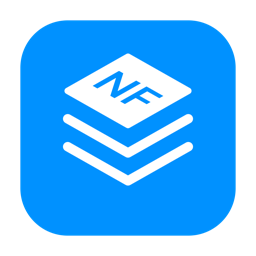
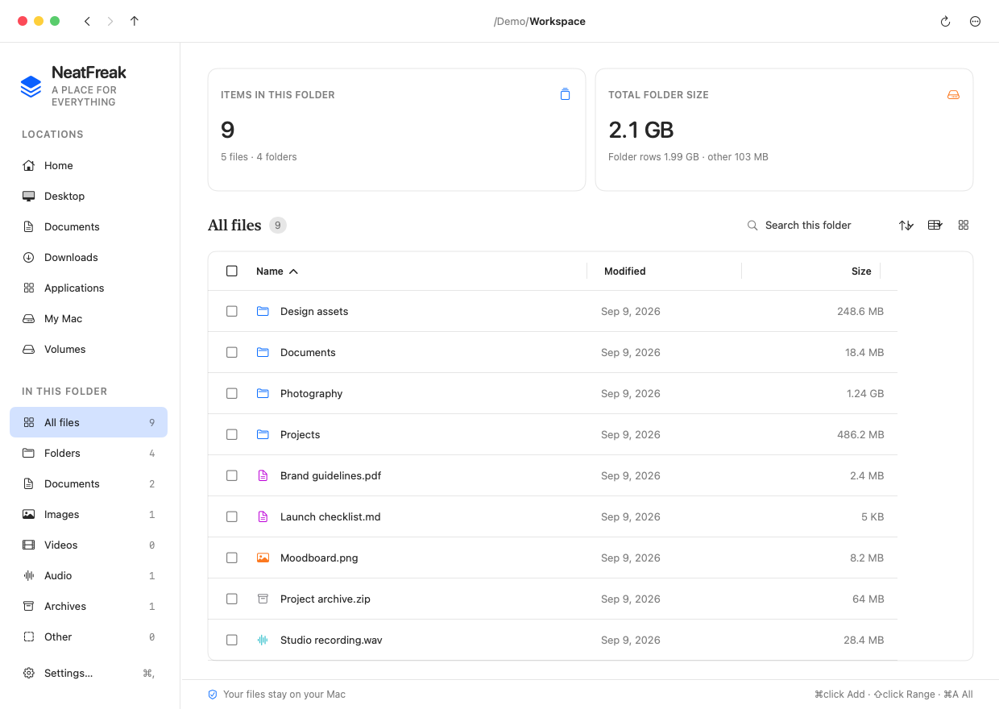

<div align="center">
  
  <h1>NeatFreak</h1>
  <p><strong>파일은 제자리에. 작업은 더 편안하게.</strong></p>
  <p>폴더를 자유롭게 탐색하고, 용량을 파악하고, 파일을 바로 미리 보세요.<br>Mac을 위한 네이티브 파일 유틸리티.</p>
  <p>macOS 14 이상 · Apple Silicon & Intel · 0.1.0 Preview</p>
  <p><a href="#설치">설치</a> · <a href="https://github.com/sean-lab/homebrew-neatfreak/releases">다운로드</a> · <a href="README.md">English</a></p>
</div>

<picture>
  <source media="(prefers-color-scheme: dark)" srcset="images/neatfreak-dark.png">
  <source media="(prefers-color-scheme: light)" srcset="images/neatfreak-light.png">
  
</picture>

<p align="center"><sub>앱 화면 구성요소에 가상 데이터를 넣어 렌더링했습니다. 실제 개인 파일이나 데스크톱 캡처는 사용하지 않았습니다.</sub></p>

## 파일 관리에 필요한 기능을 한곳에

| 탐색 | 용량 확인 | 파일 작업 |
| :--- | :--- | :--- |
| 이전·다음·상위 폴더 이동과 경로 직접 입력 | 하위 폴더 내부까지 포함하는 용량 계산 | 여러 파일을 선택해 복사·이동·휴지통 처리 |
| 컬럼 헤더 정렬, 컬럼·양쪽 패널 너비 조절 | 탐색 중 캐시 재사용과 파일 시스템 변경 반영 | 오른쪽 패널 미리보기와 **Open With** |

**익숙한 Mac 환경.** 라이트·다크·시스템 테마, macOS 단축키, 파일 종류별 아이콘을 제공합니다. 한국어·영어·일본어·중국어 간체를 지원합니다.

**파일은 내 Mac에 그대로.** 계정 생성이나 파일 업로드 없이 로컬 파일과 폴더를 관리합니다.

## 설치

```sh
brew install --cask sean-lab/neatfreak/neatfreak
```

**macOS 14 Sonoma 이상**에서 동작하며, 하나의 앱으로 **Apple Silicon과 Intel Mac**을 지원합니다.

직접 설치하려면 [Releases](https://github.com/sean-lab/homebrew-neatfreak/releases)에서 ZIP을 내려받아 압축을 풀고 `NeatFreak.app`을 응용 프로그램 폴더로 옮기세요.

> **테스트 버전 안내:** 0.1.0은 임시 서명된 앱으로 Apple 공증을 받지 않았습니다. 최초 실행 시 **시스템 설정 → 개인정보 보호 및 보안**에서 승인이 필요할 수 있습니다. 설치 과정에서 Gatekeeper를 우회하거나 보안 설정을 변경하지 않습니다.

이미 수동 설치했다면 앱을 종료하고 기존 앱을 `/Applications` 밖으로 옮긴 뒤 Homebrew로 설치하세요. 문서 파일에는 영향을 주지 않습니다.

## 키보드로 더 빠르게

| 단축키 | 동작 |
| :--- | :--- |
| `↑` / `↓` | 파일 선택 이동 |
| `⌘` + 클릭 / `⇧` + 클릭 | 선택 추가 / 범위 선택 |
| `⌘A` | 파일 목록에 포커스가 있을 때 전체 선택 |
| `⌘[` / `⌘]` | 이전 / 다음 폴더 |
| `⌘↑` | 상위 폴더 |
| `⇧⌘G` | 경로 편집; Enter로 이동 |
| `⌘R` | 새로 고침 |
| `⌘,` | 설정 |

타이틀 바의 경로를 더블 클릭해 편집할 수도 있습니다. 방향키로 폴더 후보를 선택하고, Tab으로 경로를 완성한 뒤 Enter로 이동하세요.

## 업데이트와 삭제

```sh
brew update
brew upgrade --cask sean-lab/neatfreak/neatfreak
brew uninstall --cask neatfreak
```

일반 삭제 시 설정은 남습니다. 저장된 설정과 위치도 지우려면 `brew uninstall --cask --zap neatfreak`을 사용하세요.

## 용량 표시 알아두기

표시하는 값은 실제 디스크 점유 공간이 아닌 **논리적 파일 크기의 합계**입니다. APFS 복제 파일이나 희소 파일 때문에 디스크 사용량과 다를 수 있습니다. 접근할 수 없는 폴더는 일부만 집계될 수 있으며, 용량 계산이 추가 접근 권한을 부여하지는 않습니다.

## 제작 및 문의

**Sanghyun Park** · [seanlab@gmail.com](mailto:seanlab@gmail.com)

[버그 신고 및 기능 제안](https://github.com/sean-lab/homebrew-neatfreak/issues)에 macOS·앱 버전과 재현 방법을 남겨주세요. 첨부 화면에서는 개인 파일명과 경로를 가려주세요.

이 저장소는 설치 정의와 배포 파일을 제공하는 독립 Homebrew tap입니다. 앱 소스는 비공개이며 Homebrew 공식 Cask는 아닙니다.
